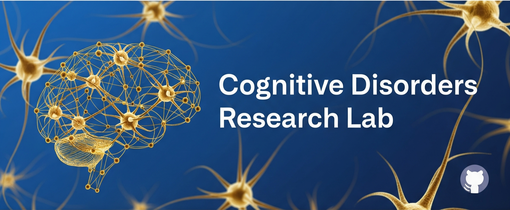

## 👨‍⚕️ About Me

I'm an MD/PhD candidate at the University of Toledo specializing in bioinformatics, clinical epidemiology, and translational research in cognitive and transplant-related disorders. I work with large-scale cohort data platforms like TriNetX and MIMIC, using R and Python to drive discovery at the interface of medicine and data science.

I am currently part of the Cognitive Disorders Research Lab at UToledo, where I focus on integrating computational tools to better understand neurological outcomes and healthcare disparities.

  
  

## GitHub Stats 📝 Recent Publications
<h2>📊 GitHub Stats &nbsp;&nbsp;&nbsp;&nbsp; 📝 Recent Publications</h2>

<table>
  <tr>
    <td>
      
    </td>
    <td>

<!--PUBMED_START-->
<ul>
  <li><a href="https://pubmed.ncbi.nlm.nih.gov/40476344/">Multi-Omic Analysis of Glutamate Excitotoxicity in Primary Neuronal Cultures</a></li>
  <li><a href="https://pubmed.ncbi.nlm.nih.gov/40233052/">Functional kinome profiling reveals brain protein kinase signaling pathways and gene networks altered by acute voluntary exercise in rats</a></li>
  <li><a href="https://pubmed.ncbi.nlm.nih.gov/39424930/">Neuronal alterations in AKT isotype expression in schizophrenia</a></li>
  <li><a href="https://pubmed.ncbi.nlm.nih.gov/38944422/">Transcriptomic Analysis of Metastatic Uveal Melanoma and Differences in Male and Female Patients</a></li>
  <li><a href="https://pubmed.ncbi.nlm.nih.gov/38559131/">Neuronal alterations in AKT isotype expression in schizophrenia</a></li>
</ul>
<!--PUBMED_END-->

    </td>
  </tr>
</table>

## 📝 Recent Publications

<!--PUBMED_START-->
- [Multi-Omic Analysis of Glutamate Excitotoxicity in Primary Neuronal Cultures.](https://pubmed.ncbi.nlm.nih.gov/40476344/)
- [Functional kinome profiling reveals brain protein kinase signaling pathways and gene networks altered by acute voluntary exercise in rats.](https://pubmed.ncbi.nlm.nih.gov/40233052/)
- [Neuronal alterations in AKT isotype expression in schizophrenia.](https://pubmed.ncbi.nlm.nih.gov/39424930/)
- [Transcriptomic Analysis of Metastatic Uveal Melanoma and Differences in Male and Female Patients.](https://pubmed.ncbi.nlm.nih.gov/38944422/)
- [Neuronal alterations in AKT isotype expression in schizophrenia.](https://pubmed.ncbi.nlm.nih.gov/38559131/)
<!--PUBMED_END-->

<!--
**huntereby/huntereby** is a ✨ _special_ ✨ repository because its `README.md` (this file) appears on your GitHub profile.

Here are some ideas to get you started:

- 🔭 I’m currently working on ...
- 🌱 I’m currently learning ...
- 👯 I’m looking to collaborate on ...
- 🤔 I’m looking for help with ...
- 💬 Ask me about ...
- 📫 How to reach me: ...
- 😄 Pronouns: ...
- ⚡ Fun fact: ...
-->
