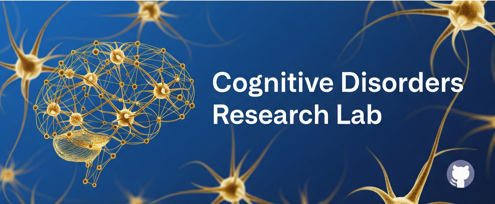

## 👨‍⚕️ About Me

  

I'm an MD/PhD candidate at the University of Toledo studying bioinformatics, clinical epidemiology, and translational research. While I work in the Cognitive Disorders Research Lab under Dr. Robert McCullumsmith, my main thesis focuses on developing a biomarker to predict renal transplant rejection prior to transplantation.

In addition, I work with large-scale data platforms such as TriNetX and iLINCS to further enhance my research.

I am currently the Director of Operations of the Kinomic Core Facility and am always interested in improving our operations to improve scientific innovation.

## Operating Systems

  
  
  

## Tools

  
  

## 📝 Recent Publications

<picture>
  <source media="(prefers-color-scheme: dark)" srcset="https://github-readme-stats.vercel.app/api?username=huntereby&theme=dark&show_icons=true&custom_title=Hunter%20Eby%27s%20GitHub%20Stats">
  <source media="(prefers-color-scheme: light)" srcset="https://github-readme-stats.vercel.app/api?username=huntereby&theme=default&show_icons=true&custom_title=Hunter%20Eby%27s%20GitHub%20Stats">
  
</picture>

<!--PUBMED_START-->
- [Multi-Omic Analysis of Glutamate Excitotoxicity in Primary Neuronal Cultures.](https://pubmed.ncbi.nlm.nih.gov/40476344/)
- [Functional kinome profiling reveals brain protein kinase signaling pathways and gene networks altered by acute voluntary exercise in rats.](https://pubmed.ncbi.nlm.nih.gov/40233052/)
- [Neuronal alterations in AKT isotype expression in schizophrenia.](https://pubmed.ncbi.nlm.nih.gov/39424930/)
- [Transcriptomic Analysis of Metastatic Uveal Melanoma and Differences in Male and Female Patients.](https://pubmed.ncbi.nlm.nih.gov/38944422/)
- [Neuronal alterations in AKT isotype expression in schizophrenia.](https://pubmed.ncbi.nlm.nih.gov/38559131/)
<!--PUBMED_END-->

<!--
**huntereby/huntereby** is a ✨ _special_ ✨ repository because its `README.md` (this file) appears on your GitHub profile.

Here are some ideas to get you started:

- 🔭 I’m currently working on ...
- 🌱 I’m currently learning ...
- 👯 I’m looking to collaborate on ...
- 🤔 I’m looking for help with ...
- 💬 Ask me about ...
- 📫 How to reach me: ...
- 😄 Pronouns: ...
- ⚡ Fun fact: ...
-->
